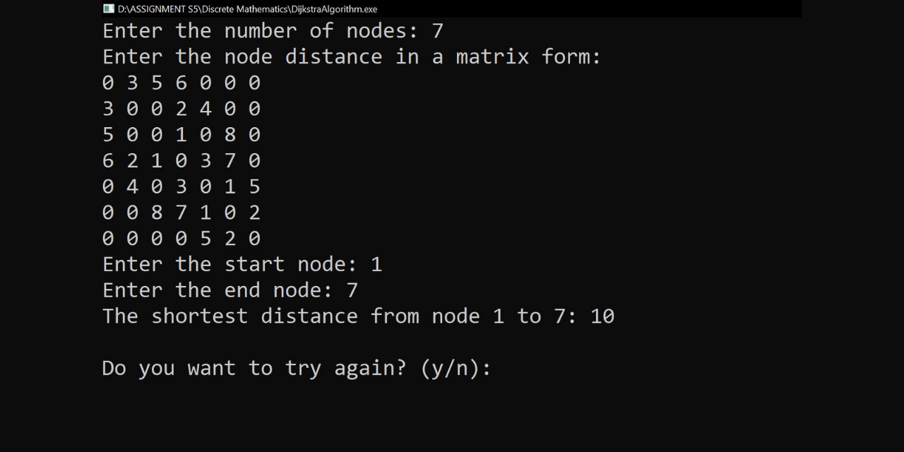

# Solving the Shortest Path Problem for a Directed Graph with Dijkstra's Algorithm using the C Programming Language
This is a project of the Discrete Mathematics course. In this project, I created a program used to solve the shortest path problem for a directed graph with Dijkstra's Algorithm using the C programming language.

Dijkstra's algorithm works by creating a path to one optimal node at each step. So, at step n there are at least n nodes for which we already know the shortest path. In the program, the user must input the number of nodes, the node distance in a matrix form, the start node, and the end node, after all the user input is filled, then the program will directly show the result (the shortest distance from the start node to the end node).

For more detail about how is the algorithm works including the simple case study on how to use this algorithm, you may download and read the report that I have already attached within this repository.

